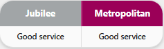

# TfL Compact Status Card

A minimal, compact custom dashboard card for Home Assistant that shows the live status of selected TfL lines side-by-side with their official colours.

Perfect for small dashboard tiles where you just need a quick glance at your commute lines.

## Preview



## Features

- 🚇 **Official TfL Line Colours**: All Tube, DLR, Elizabeth line, Overground, and Tram lines supported.
- ⚡ **Zero-Config API Access**: Fetches live status directly from the TfL API — no API keys or integrations required.
- 📐 **Ultra Compact**: ~65px total height — fits in the smallest dashboard tiles.
- ⚠️ **Disruption Highlighting**: Lines with issues are shown in red text. Hover for details.
- 🔧 **Configurable**: Show any combination of 1–4 lines side-by-side.

---

## Installation (HACS)

1. Open **HACS** in your Home Assistant panel.
2. Click **⋮** (top right) → **Custom repositories**.
3. Paste the URL of this repository.
4. Set the Type to **Dashboard**.
5. Click **Add**.
6. Find "TfL Compact Status Card" in HACS, click **Download**, and restart your frontend if prompted.

## Manual Installation

1. Download `ha-tfl-compact-card.js`.
2. Upload it to `/config/www/ha-tfl-compact-card.js`.
3. Add the Lovelace resource:
   - **Settings** → **Dashboards** → **⋮** → **Resources** → **Add Resource**.
   - URL: `/local/ha-tfl-compact-card.js`
   - Type: **JavaScript Module**

---

## Configuration

Add a manual card to your dashboard:

### Basic (Jubilee + Metropolitan)

```yaml
type: custom:ha-tfl-compact-card
lines:
  - jubilee
  - metropolitan
```

### Three Lines

```yaml
type: custom:ha-tfl-compact-card
lines:
  - central
  - northern
  - victoria
```

### With API Key & Custom Polling

```yaml
type: custom:ha-tfl-compact-card
lines:
  - jubilee
  - metropolitan
update_interval: 120
api_key: "your-tfl-api-key"
```

---

## Configuration Options

| Option | Type | Default | Description |
| :--- | :--- | :--- | :--- |
| **`type`** | string | **Required** | Must be `custom:ha-tfl-compact-card` |
| **`lines`** | list | **Required** | Line IDs to display (e.g. `jubilee`, `metropolitan`, `central`) |
| **`update_interval`** | number | `60` | Polling frequency in seconds |
| **`api_key`** | string | `null` | Optional TfL API key for higher rate limits |

## Supported Line IDs

**Tube**: `bakerloo`, `central`, `circle`, `district`, `hammersmith-city`, `jubilee`, `metropolitan`, `northern`, `piccadilly`, `victoria`, `waterloo-city`

**Other**: `dlr`, `elizabeth`, `tram`, `london-overground`, `liberty`, `lioness`, `mildmay`, `suffragette`, `weaver`, `windrush`
